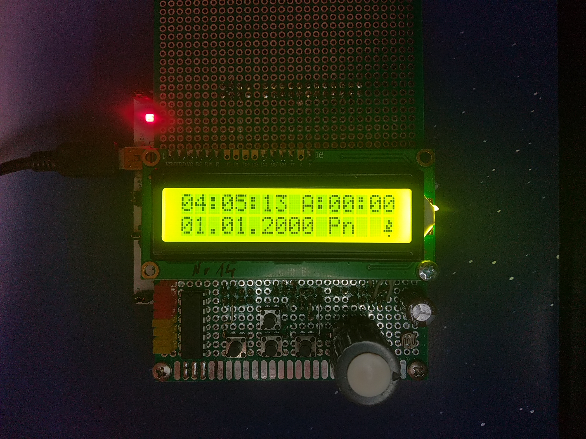
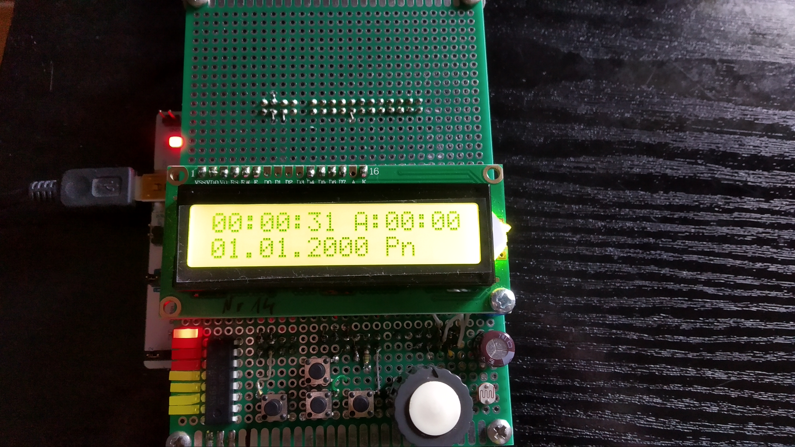
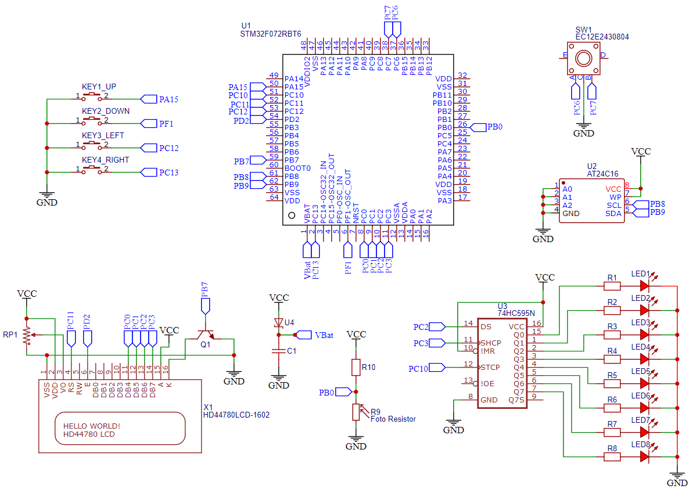

# Alarm clock on STM32
This is an alarm clock design for a microcontroller STM32.
The program was written for the subject of Electronics and microprocessor techniques.
In the project, I was in a group with my friend, whom I thank for his work.

## Table of Contents
* [Technologies And Devices Used](#technologies-and-devices-used)
* [Images](#images)
* [Diagram](#diagram)
* [Setup](#setup)
* [Presentation](#presentation)
* [Project Status](#project-status)
<!-- * [Acknowledgements](#acknowledgements) -->
<!-- * [Usage](#usage) -->

## Images

## Technologies And Devices Used
- C
- Keil uVision5
- Stm32 Cmsis
- Stm32F072RBT6

## Diagram

## Setup
To start the application you need to have installed a Keil uVision and open a file **"Eitm_Projekt.uvprojx"**, 
When connected stm32, you have to click on Build(F7) and Download(F8)

<!-- ## Usage -->

## Presentation
https://drive.google.com/file/d/1GjwicMlGvUW3ooE05sEwkgPo7u-rZu8c/view

## Project Status
Project is: no longer being worked on.

<!-- ## Acknowledgements -->

